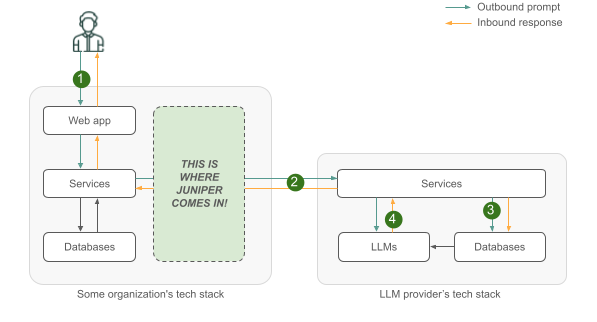
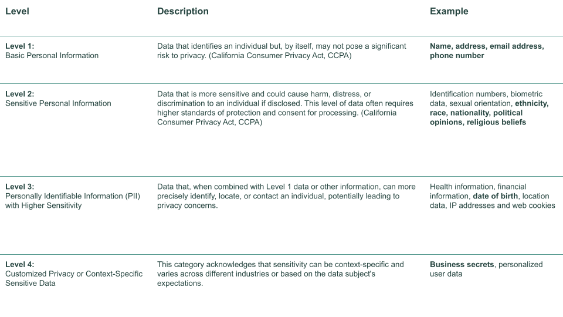
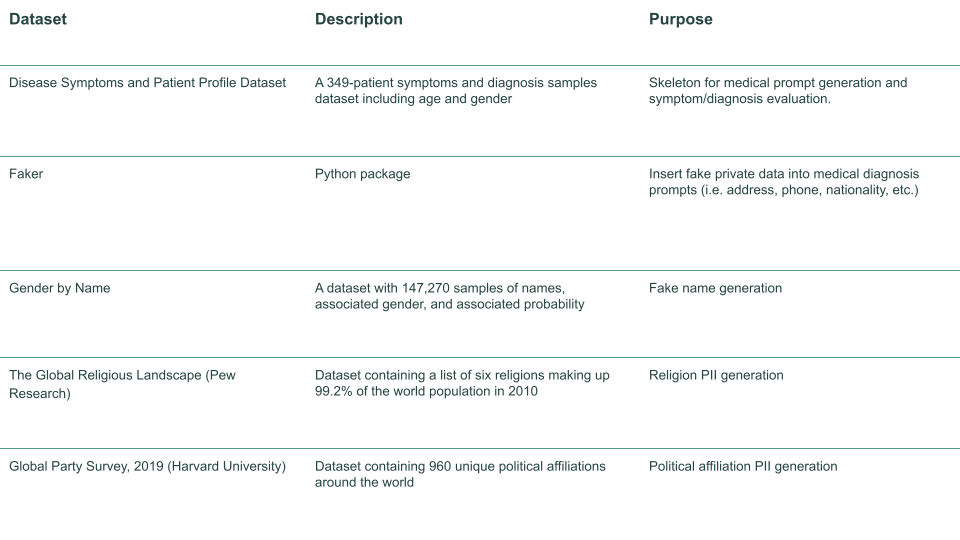
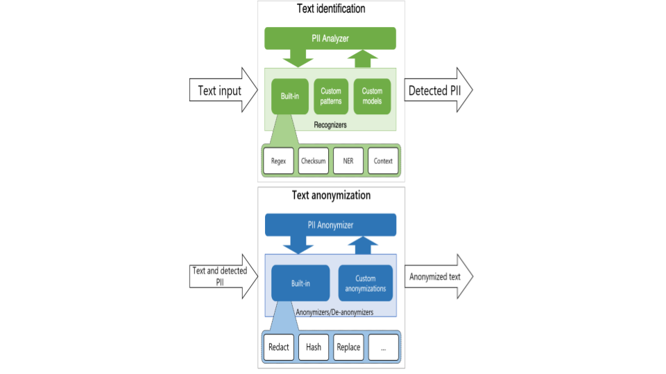

## Mission Statement

**At our core, we are committed to enabling individuals and organizations unlock the vast potential of Large Language Models by steadfastly upholding the paramount importance of privacy.**

## Team

  

## Project

Our project, JUNIPER is a proxy interface for that enables individuals and organizations to unlock the vast potential of Large Language Models (LLMs) by upholding user or organization privacy. It is applied to medical diagnosis for initial proof of concept, where large quantities of private data are present. Individuals and companies should no longer fear sensitive data leaks and utilize the power of open-source LLMs.

## Product

You can explore our product here, [Juniper](link).

## Testimonials

We have shared our product with potential users, and have had encouraging feedback, including the following quotations from stakeholders at our primary partner organizations. 

> *“Add feedback1”*
>
> *- Person1,organisation*

> *“Add feedback2”*
>
> *- Person2,organisation*

## Process

The following sections provide additional detail on the need for our project, as well as explanations of our technical approach to building our product.

### Background

There is a pervasive concern regarding privacy breaches and data exposure when utilizing LLMs-based services. Users may inadvertently divulge sensitive information in their LLM prompts, which is then shared with LLM providers and potentially used elsewhere. Moreover, organizations face stringent regulations, like GDPR, governing the handling of personal data. Additionally, conventional data anonymization methods, aimed at safeguarding privacy, often inadvertently undermine the effectiveness of downstream tasks.  

  

The application of open-source LLMs in medical diagnosis represents an important initial proof of concept, particularly given the vast amounts of private data involved in healthcare. By leveraging these language models, medical professionals can potentially improve diagnostic accuracy and efficiency. However, the prospect of utilizing such technologies also raises concerns about the security and privacy of sensitive medical data. Hence, we have Juniper as a proxy interface to prevent any private data from being stored or utilized by LLMs while they work to the best of their efficiency.

#### Levels of Privacy

To effectively filter out private data, it's imperative to establish a clear framework delineating different levels of privacy. Our approach involves categorizing private data into four distinct levels, each accompanied by commonly recognized descriptors. Within these levels, we pinpoint the specific types of data pertinent to our Minimum Viable Product (MVP). 

  

#### MVP Scope

Our MPV encompasses three primary objectives, each crucial for ensuring the effectiveness and user-friendliness of our system. Firstly, we aim to implement robust measures to redact or replace private data within prompts before they are transmitted to an open-source model, such as OpenAI. This step is essential for safeguarding the privacy of individuals and complying with data protection regulations. Secondly, we strive to maintain the integrity of the diagnostic process by ensuring that the final diagnosis remains consistent between the original prompt and the treated prompt. This consistency is vital for instilling confidence in the accuracy and reliability of our system. Finally, we prioritize user autonomy by allowing them the freedom to intervene and modify the treated prompt before it is submitted to an open-source model. Empowering users in this manner not only enhances their sense of control and trust but also enables them to tailor the diagnostic process to their specific preferences or requirements. Overall, by addressing these three key aspects, our MPV aims to deliver a comprehensive and user-centric solution for medical diagnosis while upholding privacy and accuracy standards.

### Data Sources
We used multiple datasets to address this complex privacy preservation compute problem for LLMs. 

  

### About Presidio
We leveraged Microsoft's Presidio as an accelerator for our orchestration framework to analyze and anonymize private data. Presidio allows users to preserve privacy in a simpler way by democratizing de-identification technologies and introducing transparency in decisions. It is extensible and customizable to specific business requirements. We chose presidio to leverage the Named Entity Recognition, regular expressions, rule based logic and checksum with relevant context in multiple languages. Further it also allows for integration with open-sourced (e.g. Hugging Face), internally developed models and/or codebases to analyze and anonymize private data.

  

### The Two Tower Approach
We referred to RAG and Two towers and extended the framework with our very own proprietary blacklist, embedding model and a vector database. Retrieval Augmented 
Generation (RAG) serves the purpose of retrieving relevant information to augment the prompt while Two towers are useful for publishing recommendations based on user activity on scale. Combining these two in Juniper we were able to check if the prompt contains sensitive information based on a blacklist. The following diagram helps explain the architecture better.

  

### Evaluation

### Final Output

---
